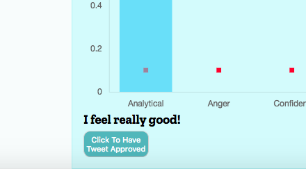
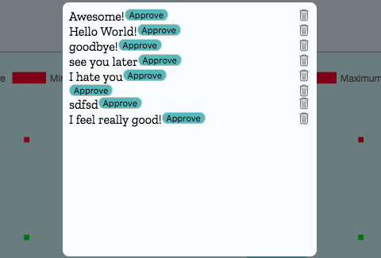

# Tonely - Tweet Sentiment Analysis
-------------------
Tonely is a web application designed to analyze tone percentages of draft tweets so that companies can establish a consistent tone amongst all customer service representatives. It also provides an approval service so that tweets may not be sumitted to Twitter unless they have been approved by a second member of the team.

https://achoi2.github.io/Tweet-Sentiment-Analysis/

## Contributors
--------------
* Andrew Choi
* Hannah Glasser
* Sara Muntean

## Who is our user?
-------------------
Brand support teams who want to conscientiously engage with customers through Twitter. 

### Brand Managers
------------------
Brand managers can establish benchmark tone ranges that all draft tweets must fall within, so that customer service members know the requirements for each tweet. Brand managers can also ensure that all tweets have been approved by a second party prior to their submission to Twitter.

### Customer Support Representatives
------------------------------------
Customer Support Representatives can input draft tweets to be analyzed through IBM Watson's Tone Analyzer to see if tones fall within the benchmark ranges established by the brand managers.

## What is their problem?
-------------------
Without Tonely, customer support representatives are able to tweet poorly worded posts and responses that may cause backlash. With Tonely, there are built in checks to ensure these problems do not arise, because tweets must fall within the benchmark ranges or be approved by a second party. 

## IBM Watson
-------------------

### Tone Analysis
-----------------
IBM Watson's built in Tone Analyzer delivers a tone score ranging from 0-1 of each of the following tones:
1. Anger
2. Fear
3. Joy
4. Sadness
5. Analytical
6. Confident
7. Tentative

The higher the score, the stronger the tone is perceived.

### Issues We Faced
-------------------
The biggest hurdle we faced was getting authorization to retrieve data from the IBM Watson server. Since our request was coming directly from a script file, the browser would not authorize us to utilize the data from the server. 

To make the request to the server, we had to use the following header on our ajax request:

`headers: {
    "Authorization": "Basic " + btoa(watsonUsername + ":" + watsonPassword)
}`

However, even with authorization from IBM Watson, Google Chrome still would not allow access to the requested data. In order to get around this, an Google Chrome Extension, "Allow-Control-Allow-Origin" that allowed us to see the data we received from our ajax request.

## Styling
----------
The overall styling for our site had a common theme: 
 
1. Clean
2. Mobile responsive
3. Intuitive

We utilized varying opacities of the same tone to create a harmonious appearance, seamlessly blending the various components of the site for a more pleasant user experience. By using multiple, reusable classes on various elements in our HTML, we were able to efficiently and clearly modify our styles. 

### Issues We Faced
-------------------

#### Loading Animation
----------------------
Getting the loading animation visuals to stagger themselves as they appeared on the screen was a challenge. Initially, all letters appeared on the screen after the same delay. In order to fix that, we had to scale the setTimeout function by a set amount of time withing our loop, seen below:

```Javascript
var doSetTimeout = function (j) {
    setTimeout(function () {
        var letter = letters[j];
        letter.classList.remove('loading-letter')
        letter.classList.add('show');
    }, i * 400);
```

#### Mobile Responsivity 
------------------------
By using media queries, we were able to scale the main div and our graph of our site to be responsive on multiple screen sizes.  We kept our media queries as simple as possible, adding to a seamless look as users shifted sizes. 

```CSS
@media (min-width: 768px) {
    .graph {
    width: 30em;
    }
    .header {
        min-width: 30em;
    }
}

@media (min-width: 1200px) {
    .graph {
        width: 50em;
    }
    .header {
        min-width: 50em;
    }
}
```

#### Modal Styling
------------------
The biggest hurdle facing the styling of the modal was positioning, and getting the layering effect, making the modal appear to pop on the screen. To do this we used the CSS position functionality to position the parent, modal backdrop container on top of the entire body of the page, and Flexbox to center it's child containers on the center of the screen. 

##### Modal Functionality
-------------------------
The copy-paste feature was by far the biggest challenge we faced when creating the modal. The built in copy command in Javascript requires the text to be copied be put inside an input or textarea tag. However, this tag did not align with our vision for the modal, as we did not want the text to be editable after approval. Additionally, Google Chrome's built in secruity features do not allow text to be automatically copied from a hidden element. 

That led us to, on clicking of the copy bottom, create an input box, fill it with the desired text, copy that text, and the delete the input box. This occurs so fast that it is essentially invisible to the user, but still provides the functionality we needed to allow for easy tweeting.

The code can be seen below:

```Javascript
var copyToClipboard = function () {
    var tweetInput = document.createElement('textarea');
    tweetInput.setAttribute('value', tweet);
    tweetInput.textContent = tweet;

    listItemContents.appendChild(tweetInput);

    var selection = document.getSelection();
    var range = document.createRange();
    range.selectNode(tweetInput);
    selection.removeAllRanges();
    selection.addRange(range);

    document.execCommand('copy');
    selection.removeAllRanges();

    tweetInput.parentNode.removeChild(tweetInput);
    alert('You have copied the tweet: ' + tweetInput.value);
};
```

## Libraries
------------
In order to effectively display the data we received from IBM Watson's tone analyzer, we needed to utilize some libraries. One of the hardest and most frustrating parts of this project was in simply just deciding on which libraries to use. There are so many available options, and the challenge was to pick a library that could do what you needed it to, while also being easy to integrate into the project and unlikely to interfere with any other functionality. The two main libraries we landed on were Chart.js and noUiSlider.

### noUiSlider
--------------
Before we displayed the data we got back from IBM Watson, we wanted to give the user a chance to set boundaries in order to capture the appropriate tone in their drafted tweet. The boundaries would include a minimum, target, and maximum value for each of the seven tones. In order to avoid crowding the screen with a bunch of input boxes, or shuffling the user through each tone individually, we needed a way to display all seven tone ranges simultaneously. Range sliders ended up being the best option - and we were able to use the noUiSlider library to quickly style them and allow for three handles. The trickiest part of this process was testing out two other libraries prior to settling on noUiSlider, only to realize that we were having the same issues that countless other users had experienced and the github repositories were no longer being updated or maintained for those libraries. 

### Chart.js
------------
Chart.js was utilized in this project to display the data from IBM Watson on a graph that also showed the benchmarks set by the user. The graph creation was a relatively smooth process, and we did not have to tweak much in regards to the styling or the responsiveness. The biggest lesson we learned with this library was to make sure to fully read through the documentaiton and understand the limitations of the code before trying to create something. We had a vision in mind, but after many attempts to make it happen and a thorough review of the library - we realized what we wanted wasn't exactly an option with Chart.js. We went back to the drawing board armed with a better understanding of what we could accomplish. The final product had the exact functionality we wanted, but with some slight style adjustments that matched the newly adjusted goal.

### Firebase
------------
We needed a way to store tweets so that others can view what has been submitted. For this we decided to use the firebase API.The firebase API will easily allow our users to store and share data in real time. 

When the user is satisfied with the analysis of their tweet, they can then store their tweet. By pressing the “Tweet Approved” button, the user’s tweet gets sent to firebase. 





Once the button has been pressed, a modal will pop up. Next, the user will get back the tweets that have been sent to firebase, and can see it in the modal. By showing the tweets that have been submitted, someone else can view the tweets and review it. 





One of the challenges that we faced with firebase was when we pressed the "Submit for Analysis" button. When pressed, a tweet would get entered into firebase. We only wanted the tweet to get entered if the "Tweet Approved" button was clicked. We were able to fix this problem by refactoring our code and making use of more functions.
